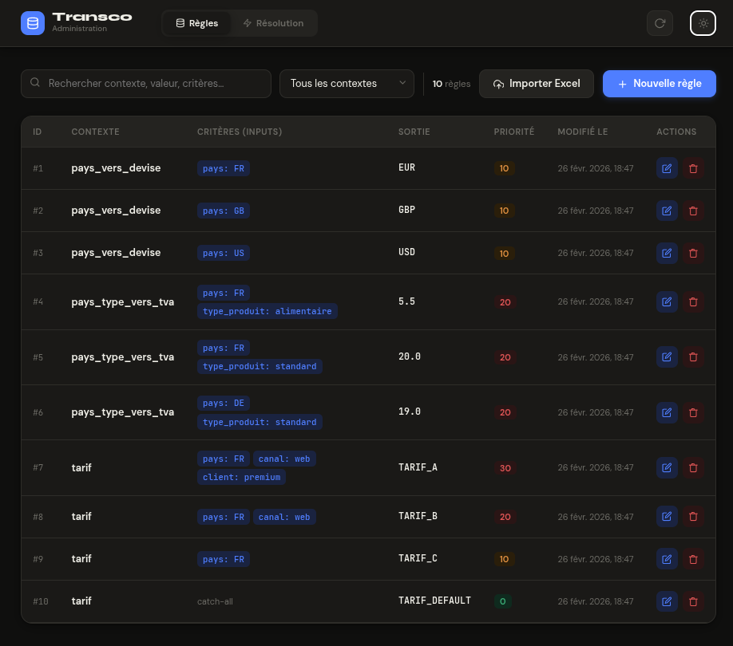
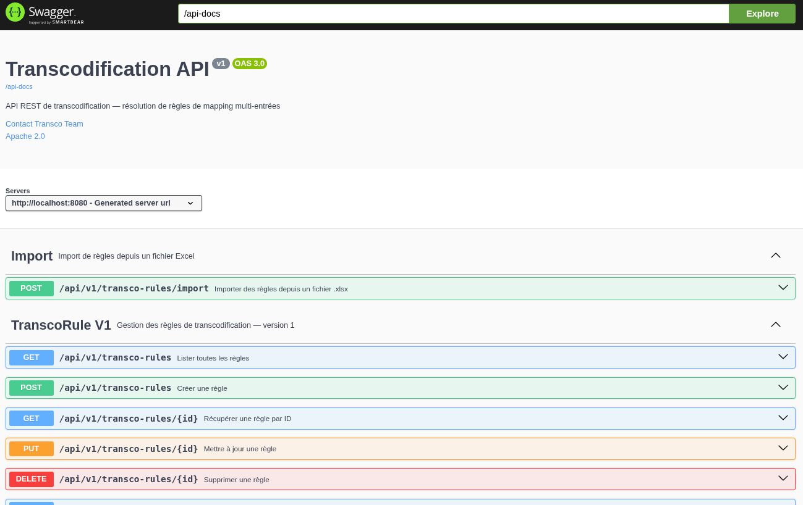

# ⚙️ Transco API

> **Moteur de transcodification générique** — résolvez n'importe quelle valeur métier à partir de critères d'entrée multiples, avec fallback intelligent et gestion des priorités.


---

## 🎯 Pourquoi Transco API ?

Dans tout système d'information métier, on retrouve le même problème récurrent : **résoudre une valeur de sortie à partir d'une combinaison de critères d'entrée**.

Exemples concrets :
- Quel **tarif** appliquer selon le pays, le canal et le type de client ?
- Quel **compte comptable** affecter selon la nature de la dépense et le centre de coût ?
- Quel **code produit** utiliser selon le référentiel partenaire et la catégorie article ?
- Quelle **règle de TVA** appliquer selon le pays de facturation et le type de prestation ?

Sans outillage dédié, ces règles finissent enfouies dans du code métier difficile à maintenir, des fichiers Excel gérés manuellement, ou des tables de correspondance éparpillées dans les bases de données.

**Transco API centralise, fiabilise et expose ces règles via une API REST standard.**

---

## ✅ Ce que ça résout concrètement

| Problème classique | Ce qu'apporte Transco API |
|---|---|
| Règles de mapping codées en dur | Externalisation totale dans une base de données |
| Mise à jour nécessitant un déploiement | Modification à chaud via l'interface d'admin ou l'API |
| Pas de gestion de priorité entre règles | Système de priorité natif + fallback configurable |
| Import manuel fastidieux | Import en masse depuis Excel (`.xlsx`) |
| Pas de traçabilité des règles | Horodatage automatique de chaque règle |
| Duplication entre projets | Moteur générique réutilisable, multi-contexte |

---

## 🧠 Principe de fonctionnement

Une règle associe un **contexte**, des **critères d'entrée** (paires clé/valeur libres) et une **valeur de sortie**.

Lors d'une résolution, le moteur :
1. Recherche la règle dont les critères sont contenus dans les inputs fournis
2. Retourne celle qui a la **priorité la plus haute**
3. Si aucune règle exacte n'est trouvée et que le **fallback est activé**, il remonte vers des règles plus génériques jusqu'à une éventuelle règle *catch-all*

### Exemple — Résolution de tarif

| Contexte | Critères d'entrée | Valeur de sortie | Priorité |
|---|---|---|---|
| `tarif` | `{pays: FR, canal: web, client: premium}` | `TARIF_A` | 30 |
| `tarif` | `{pays: FR, canal: web}` | `TARIF_B` | 20 |
| `tarif` | `{pays: FR}` | `TARIF_C` | 10 |
| `tarif` | `{}` | `TARIF_DEFAULT` | 0 |

**Requête** avec `{pays: FR, canal: web, client: standard}` → retourne **`TARIF_B`** (fallback sur 2 critères).

---

## 🏗️ Architecture

```
transco-api/                         ← Backend Spring Boot
└── src/main/java/com/transco/api/
    ├── controller/v1/               ← Endpoints REST versionnés
    ├── dto/v1/                      ← Records Java 21
    ├── entity/                      ← Entité JPA
    ├── mapper/v1/                   ← MapStruct
    ├── repository/                  ← Requêtes JSONB natives (opérateur @>)
    └── service/v1/ + impl/v1/      ← Logique métier

transco-admin/                       ← Frontend React 18 / Vite
└── src/App.jsx                      ← Interface d'administration
```

### Stack technique

| Couche | Technologie | Justification |
|---|---|---|
| Backend | Java 21 · Spring Boot 3 | LTS, performances records, records Java |
| Base de données | PostgreSQL + JSONB | Critères flexibles, index GIN natif |
| Mapping | MapStruct | Zéro réflexion, performances compilées |
| Documentation API | SpringDoc / Swagger UI | Contrat API auto-généré |
| Frontend admin | React 18 · Vite | Interface légère, hot-reload instantané |
| Import de données | Apache POI | Import Excel `.xlsx` natif |

---

## 🗄️ Modèle de données

```sql
CREATE TABLE transco_rule (
    id           BIGSERIAL PRIMARY KEY,
    context      VARCHAR(100) NOT NULL,
    inputs       JSONB        NOT NULL,
    output_value TEXT         NOT NULL,
    priority     INT          DEFAULT 0,
    created_at   TIMESTAMP    DEFAULT NOW(),
    updated_at   TIMESTAMP    DEFAULT NOW()
);

CREATE INDEX idx_transco_inputs ON transco_rule USING GIN (inputs);
CREATE UNIQUE INDEX idx_transco_unique ON transco_rule (context, inputs);
```

Le choix du type `JSONB` avec l'opérateur `@>` permet des **requêtes de résolution en O(log n)** sans schéma figé sur les critères d'entrée.

---

## 🔌 API REST

Toutes les routes sont versionnées (`/api/v1/`) pour garantir la rétrocompatibilité.

| Méthode | Endpoint | Description |
|---|---|---|
| `GET` | `/api/v1/transco-rules` | Liste toutes les règles |
| `GET` | `/api/v1/transco-rules/{id}` | Récupère une règle par ID |
| `POST` | `/api/v1/transco-rules` | Crée une nouvelle règle |
| `PUT` | `/api/v1/transco-rules/{id}` | Met à jour une règle existante |
| `DELETE` | `/api/v1/transco-rules/{id}` | Supprime une règle |
| `POST` | `/api/v1/transco-rules/resolve` | **Résout une valeur de sortie** |
| `POST` | `/api/v1/transco-rules/import` | Importe des règles depuis `.xlsx` |

### Exemple de résolution

```bash
curl -X POST http://localhost:8080/api/v1/transco-rules/resolve \
  -H "Content-Type: application/json" \
  -d '{
    "context": "tarif",
    "inputs": { "pays": "FR", "canal": "web" },
    "withFallback": true
  }'
```

Swagger UI disponible sur `http://localhost:8080/swagger-ui.html`.

---

## 📥 Import Excel

Le endpoint `POST /api/v1/transco-rules/import` accepte un fichier `.xlsx` en multipart.

**Format attendu** — colonnes fixes + colonnes dynamiques :

| context | output_value | priority | pays | canal | client |
|---|---|---|---|---|---|
| tarif | TARIF_A | 30 | FR | web | premium |
| tarif | TARIF_B | 20 | FR | web | |
| tarif | TARIF_DEFAULT | 0 | | | |

**Réponse :**

```json
{
  "inserted": 8,
  "skipped": 2,
  "rejected": 0,
  "errors": []
}
```

---

## 🚀 Démarrage rapide

### Prérequis

- Java 21 · Maven 3.8+ · PostgreSQL 14+ · Node.js 20+

### Backend

```bash
psql -U postgres -c "CREATE DATABASE transco;"
psql -U postgres -d transco -f src/main/resources/init.sql
# Configurer src/main/resources/application.properties
mvn spring-boot:run
```

→ API : `http://localhost:8080`  
→ Swagger : `http://localhost:8080/swagger-ui.html`

### Frontend

```bash
cd transco-admin && npm install && npm run dev
```

→ Interface : `http://localhost:5173`

---

## 📸 Aperçu

| Interface Admin | Swagger UI |
|---|---|
|  |  |

---

## 🔮 Axes d'évolution possibles

- 🔐 Sécurisation OAuth2 / JWT des endpoints
- 📊 API de statistiques d'utilisation (règles les plus sollicitées)
- 🌐 Support multi-tenant (isolation par organisation)
- 🐳 Image Docker officielle + `docker-compose.yml`
- 📦 Publication sur Maven Central comme librairie embarquable

---

## 🤝 Contribution

1. Forkez le dépôt
2. Créez une branche (`git checkout -b feature/ma-feature`)
3. Committez (`git commit -m 'feat: ma feature'`)
4. Ouvrez une Pull Request

---

## 📄 Licence

MIT — libre d'utilisation, modification et distribution, y compris à usage commercial.

---

*Conçu pour les équipes qui en ont assez de recoder les mêmes tables de correspondance.*
